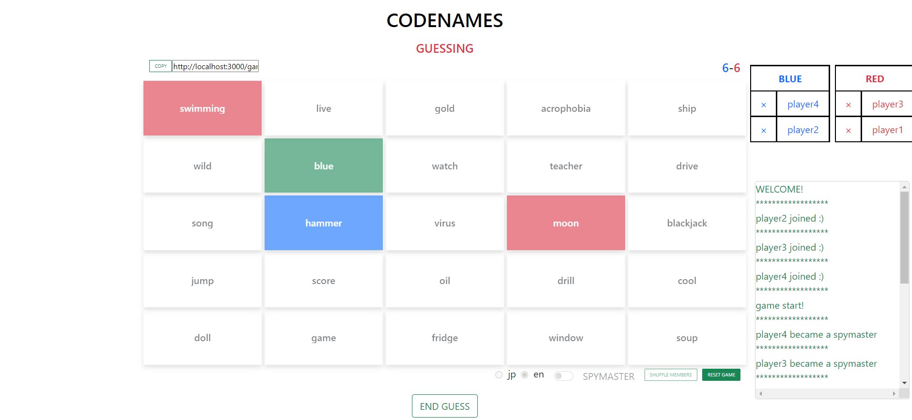
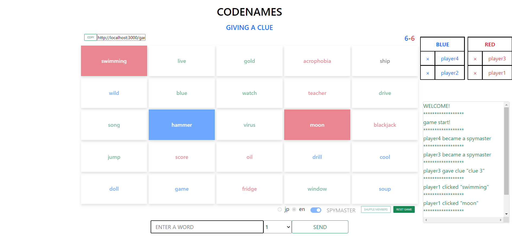

# Codenames
This is a web app to play Codenames for 4-10 players. In this app, you can choose languages for words, japanese or english.  

A hosted web app is available at [https://www.codenames.ml](https://www.codenames.ml/) 

# Sample image
 

# Why I built this app? 
I wanted to improve my development skills, especially backend skills. I've never built apps that can be published like this and wanted to use the knowledge of CS. (I finally did it!) 

# Architecture
You can see the architecture,UML and ERD in [here](https://github.com/yk-jp/Codenames/tree/master/docs/architecture).  

# Getting started

## Prerequisites
*  Settings for MySQL(install MySQL and prepare a schema you want to use.)

## Usage 

### Clone repository
First, run this command to clone this repository down to your local machine.

```
git clone https://github.com/yk-jp/Codenames.git
```

### Move to the server folder
```
cd server
``` 

### Database settings

Create a `.env` file in **server folder(not in src folder)** and add following environment variables there.

```
DB_USER = //username 
DB_NAME = // schema name 
DB_PASSWORD = //password
DB_HOST =  //hostname
```

### Install Dependencies (frontend & backend)

Run following commands 
```
npm install 
npm run client-install 
```

### Start app

To start app, Run following commands 
```
npm run concurrent-start
```

### Store words in database
Now that the database is connected to backend, tables should be automatically created in the schema you created beforehand.

Before playing it, you need to add words in database.
I prepared words to play in japanese and english version. (you can see them in `server/src/assets`)

If you want to use them, comment out `initializeWordList()` in `server/src/index.ts` and run it at once. Those words should be stored in words table.

```
// initialize wordlist in db
// initializeWordList(); // line 29 in index.ts
```

Open http://localhost:3000 in your browser to see the result.
 
# Tech stack 
frontend 
*  HTML
*  CSS
*  Bootstrap 
*  React
*  Typescript

backend 
*  Node.js
*  Typescript 
*  Socket.io
*  Sequelize(ORM)
*  MySQL
